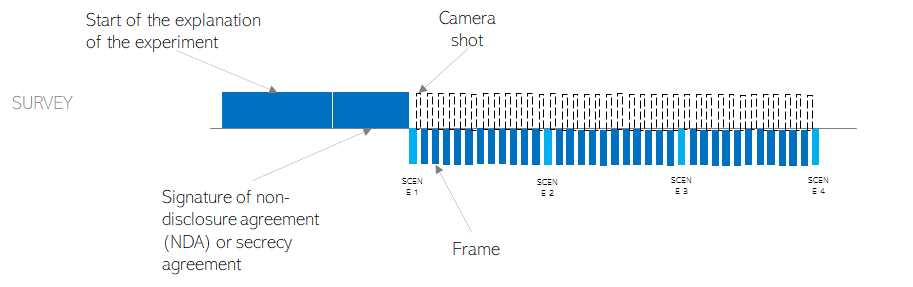
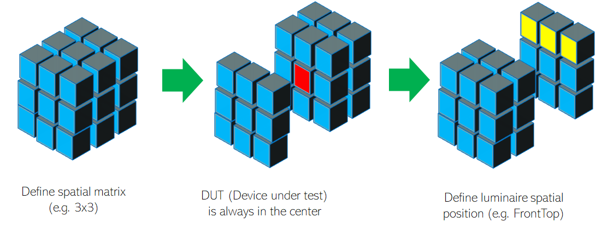
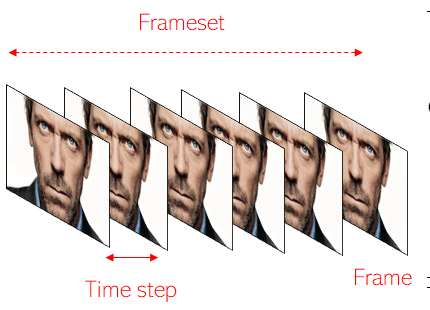
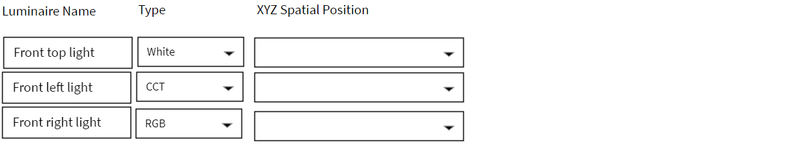

<!-- Title -->
<h1 align="center" id="helios">
    helios 
</h1>
<!-- Tag line -->
<h3 align="center">Lighting Scenario Laboratory.</h3>

----
# What's the point?
> The goal is to achieve the best light mixing by shooting multiple camera images with different lighting configurations. The result is a matrix of pictures to compare the best lighting configuration. In the meantime, log sensor meassurements (like distance, etc) will be processed to help with the analysis. The proffesionals that can be interested are portrating amateurs, imaging for data science purposes and testing laboratories for better color rendering surfaces. All of them having in common the optimization of the best light.

<p align="center">
    
</p>

# Experiment Workflow 
The experiment consists of 3 phases:
Development   |  Production | Results
--------------|-------------|--------------
Prepares the experiment Settings | Executes the experiment | ETL (Extraction, Transformation and Load) and visualization of all data

Preparing the test survey consists of defining the procedure, timming and data to gather during the experiment:
<p align="center">
    
</p>

The luminaires are registered in a database with its DMX512 information as well as spatial coordinates for better managing light. The light management will consist on brightness dimming, CCT (Color) tunning, setting RGB color and balancing light from different spatial locations.  

For the spatial balancing of light, we will create a **spatial scenario cube** or SCC, where the DUT (Device Under Test) is in the center: 
<p align="center">
    
</p>
The default size of the spatial scenario cube  is a 3x3 matrix. This will be used for balancing light in the xyz coordinates.

Each luminaire is in one or several spatial coordinates.

For determining the whole range of light to be tested, we will define the different seed-scenes, e.g.:
1. Cold light coming from Left
2. Warm light coming from right
3. Warm light coming from everywhere 

Once created all scenes, you should compose scenes' lighting, editing each scene and luminaire: 
* step up/down brightness or set brightness by value
* step up/down cct or set cct by value
* set rgb by value
* turn on/off light by switching
* balance light spatially


After defining the scenes, we will create the Screenplay, that consists of:
* define the sequence of scenes (e.g. [1,2,3])
* define the ammount of frames for each transition (e.g. [25,25], 25 frames for each one of both transitions)


The resulting numpy array stores the whole lighting frameset:

```
 Scene:      |00------------------------------>01----------------------------->02---------------------------->03|
 Frame:      |00|01|02|03|04|05|06|07|08|09|10|00|01|02|03|04|05|06|07|08|09|10|00|01|02|03|04|05|06|07|08|09|10|
 Sensor:     |X--X--X--X--X--X--X--X--X--X--X--X--X--X--X--X--X--X--X--X--X--X--X--X--X--X--X--X--X--X--X--X--X-|
 Shoot:      |-X--X--X--X--X--X--X--X--X--X--X--X--X--X--X--X--X--X--X--X--X--X--X--X--X--X--X--X--X--X--X--X--X|
 Time:       |00|01|02|03|04|05|06|07|08|09|10|11|12|13|14|15|16|17|18|19|20|21|22|23|24|25|26|27|28|29|30|31|32|
```

The last step before the execution is defining each time [msec]:
* idle1: sleep time, no action
* shot: time after the camera shot
* sensor: time after meassuring sensors data
* idle2: time after finishing the whole process
 
<p align="center">
    
</p>

```
             |------------------------frame------------------------------|
             |---------idle1---------|---shot---|-sensor-|-----idle2-----|
```

## Development

Describe the testing scenario    | Manage Luminaires |Plan scenes' screenplay |Compose scenes' lighting |Frameset dynamics editor |
------------ | -------------|-----------------|-----------------|-----------------
Describe and compose spatialy the whole scenario |Manage the Luminaires' Master identifying luminaires and their characteristics.| Define the different lighting scenes accross the screenplay of the experiment. |For each scene, edit the combination of light brightness, CCT, RGB for all luminaires and balance light spatially from every orientation.|Define frameset scenes sequence order and number of frameshots between scenes. Define the sensors data sources to log data meanwhile. Define the timming for each task (camera shoot, sensors and idle times).

Follow this [test reference code](https://github.com/arocavanaclocha/helios/blob/main/test.py).
* Helios > Create instance
* Helios > Development > Describe the testing scenario
* Helios > Development > Manage Luminaires 
* Helios > Development > Plan scenes' screenplay
* Helios > Development > Compose scenes' lighting
* Helios > Development > Frameset dynamics editor

Manage Luminaires
<p align="center">
    
</p>


Light Composer
<p align="center">
    
</p>


## Production

## Post-Production
Show results (Portrait matrix, lighting settings, sensor data (Linear distance, LIDAR Movements heat map, temperature & Humidity, etc). Post-processing, like RGB histogram analysis, etc

Execute the experiment| Post-Processing
| Automate the process following the previous steps.|Show results (Portrait matrix, lighting settings and sensor data.

# Model

```
    Scenario
        |
        |--LuminaireSet
        |--ScreenPlay
        |--Light
        |--Frameset
        |--Settings
```


# Instalation
```
!git clone https://github.com/arocavanaclocha/helios.git 
!python /content/helios/core/helios.py
import helios.core.helios as helios
```
# Reference code
* [DMX reference code](https://github.com/MattIPv4/PyDMXControl/tree/master/tests)


# Status
- [x] Starting goals
- [ ] Features and wireframe 
- [ ] list syntax required (any unordered or ordered list supported)@mentions, #refs, [links](), **formatting**, and <del>tags</del> supported
- [ ] ~~things not to do~~
