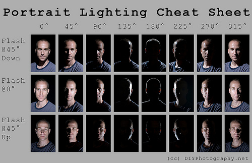
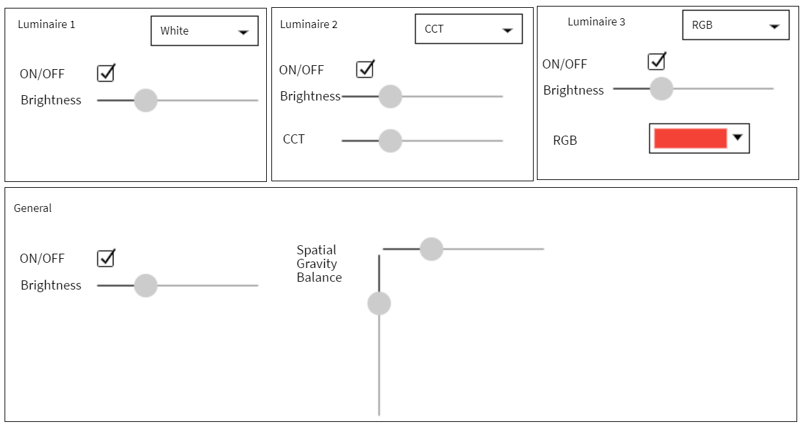

# helios - Lighting Scenario Laboratory 
Our goal is to achieve the best mixing light for portraiting by shooting images testing with many different light configurations.
The result is a matrix of pictures to compare the best lighting,  check sensor meassurements (distance, etc) and help portrating amateurs optimizing the scene.

# Features
1. New/load/save scenarios with different configurations 
2. Compose scenario lighting by configuring different DMX512 lighting Luminaires 
3. Define different light transitions (Scenes) with different brightness, color temperature (cct), rgb 
4. Define camera shooting configuration and sensors

# Process 
1. Architect > Describe scenario
Name and Remarks of the current scenario. 
2. Architect > Compose scenario lighting
Defines the LuminaireSet, that is:
* all Luminaires available in the scenario
* if the light is White Dimable, CCT Tunable or RGB
* a unique name
* and a spatial position in the scenario
3. Architect > Plan scenes screenplay
Defines the different scenes. Later we will configure the light for each scene.
4.  Architect > Configure light scene for each scene
For each scene, each luminaire or the whole scenario can be edited: 
* step up/down brightness or set brightness by value
* step up/down cct or set cct by value
* set rgb by value
* turn on/off light by switching
* balance light spatially

# Reference code
* [test reference code](https://github.com/arocavanaclocha/helios/blob/main/test.py)
* [DMX reference code](https://github.com/MattIPv4/PyDMXControl/tree/master/tests)
